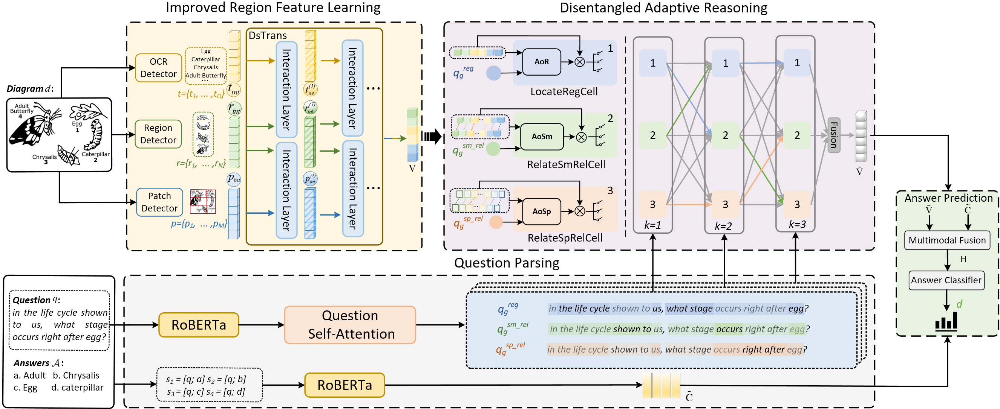

# DisAVR: Disentangled Adaptive Visual Reasoning Network for Diagram Question Answerin

## Introduction
Diagram Question Answering (DQA) aims to correctly answer the question about the given diagram, which demands an interplay of good diagram understanding and effective reasoning. In this paper, we propose a Disentangled Adaptive Visual Reasoning Network for DQA, named DisAVR, which jointly optimizes the dual-process of representation and reasoning. DisAVR mainly consists of three modules including improved region feature learning, question parsing, and disentangled adaptive reasoning.



## Dependencies:
To use this code you will need:
* pytorch 1.12.0
* transformers 4.30.2
* spacy 3.5.3
* tqdm 4.65.0

## How to run the experiments 
```
python main.py -run_mode train  (training mode)
python main.py -run_mode test    (test mode)
```

## Datasets
* AI2D: Download this dataset from [AI2D.zip](https://pan.baidu.com/s/1PfncjKutNaIijM1xNK1pVg)
* FOODWEBS: Download this dataset from [FOODWEBS](https://allenai.org/data/foodwebs)
* CSDQA: Download this dataset from [CSDQA](https://github.com/WayneWong97/CSDia)  

  
Note:
Please unzip them into the repository folder.

# The code will come soon once the paper is published! 
